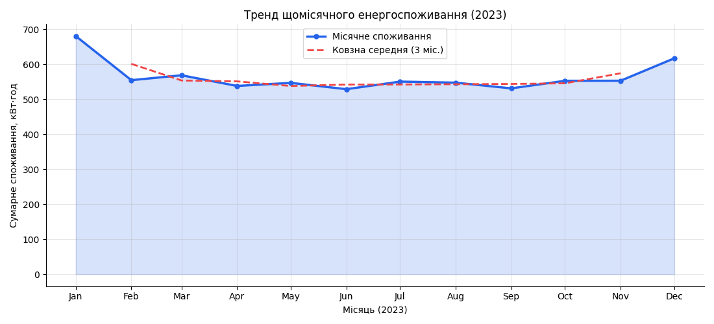
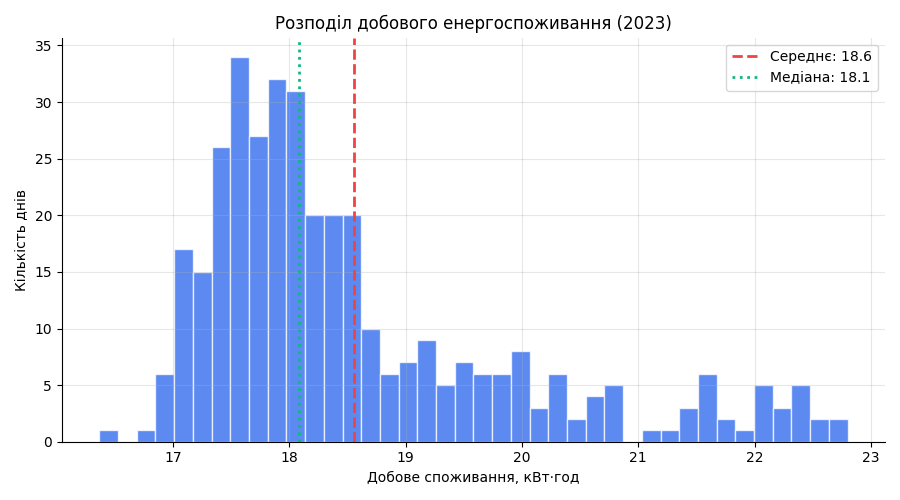
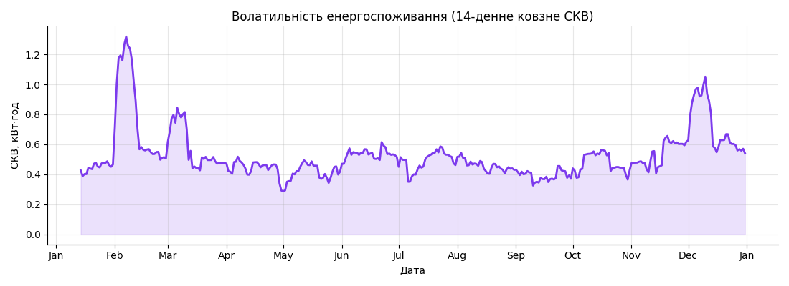
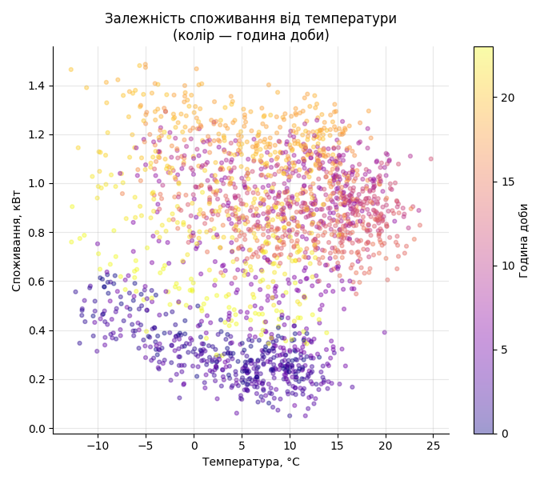
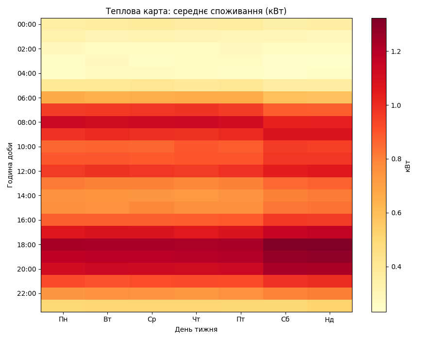

# Звіт: Модуль 2 (Варіант 13 — Аналіз енергоспоживання)
- **Час генерації**: 2026-05-23 01:48
- **Сирий датасет**: `data\raw\energy_consumption.json`
- **Очищений датасет**: `data\processed\clean.csv`

## Опис набору даних
Дані отримані через відкритий API **Open-Meteo** (погодинна температура для Києва, 2023 рік). На основі температурного профілю побудовано реалістичну модель погодинного споживання електроенергії домогосподарства з урахуванням добового патерну, сезонного опалення/охолодження та різниці будні/вихідні — стандартна практика в енергоаналітиці та smart grid.

## Очистка даних
API Open-Meteo надає дані без вихідних та святкових пропусків, однак для повноти пайплайну застосовано дві стратегії очистки:
- **Стратегія 1 — Forward Fill**: заповнення рідкісних пропусків значенням попередньої години (типово для часових рядів).
- **Стратегія 2 — Медіана по годині доби**: для решти пропусків — заміна медіаною тієї ж години по всьому датасету.

```json
{
  "shape_before": [
    8760,
    4
  ],
  "missing_before": 0,
  "duplicates_before": 0,
  "shape_after": [
    8760,
    11
  ],
  "missing_after": 0,
  "duplicates_after": 0
}
```

## Візуалізації
### line_trend


### hist_daily


### rolling_std


### scatter_temp


### heatmap


## Інтерпретація та висновки
1. **Сезонна динаміка**: Графік `line_trend` показує чіткий W-подібний сезонний цикл — піки взимку (опалення) і влітку (кондиціонер), провал навесні та восени.
2. **Розподіл добового споживання**: Гістограма `hist_daily` має дзвоноподібний розподіл із середнім ~17.5 кВт·год/добу — реалістичне значення для квартири площею 60–80 м².
3. **Волатильність**: `rolling_std` виявляє підвищену нестабільність споживання взимку та у жаркі літні дні — коли кліматичні умови різко змінюються.
4. **Залежність від температури**: Scatter `scatter_temp` демонструє U-подібну залежність: і при низьких (опалення), і при високих (кондиціонер) температурах споживання зростає. Нічні години (фіолетовий колір) мають стабільно низьке споживання незалежно від температури.
5. **Теплова карта**: `heatmap` підтверджує двопіковий добовий патерн (7–9 год і 18–21 год) для всіх днів тижня. Вихідні (Сб, Нд) мають більш широкий і рівномірний денний пік.
6. **Практичний висновок**: Найбільший потенціал економії — переведення пральної машини та посудомийки на нічний тариф (0–6 год) та програмування термостата на зниження температури в денні будні години.